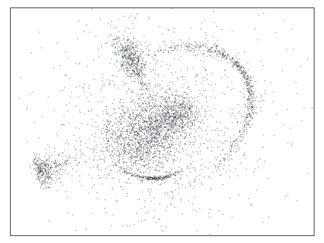
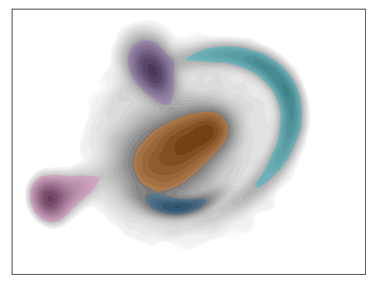
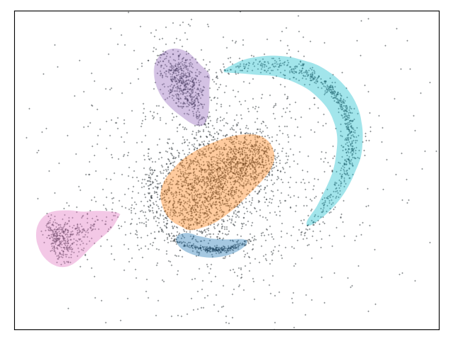
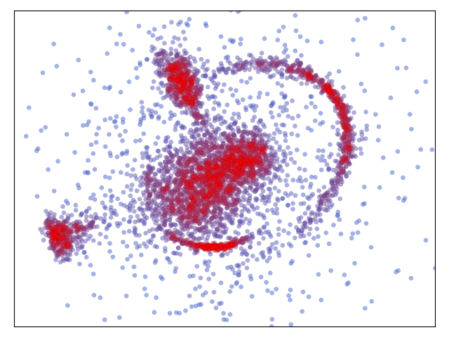
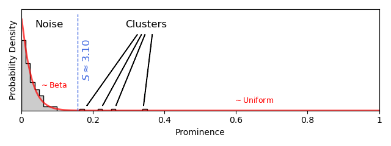
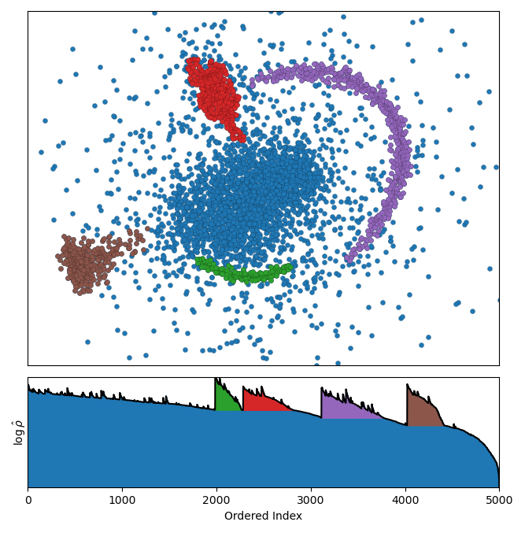
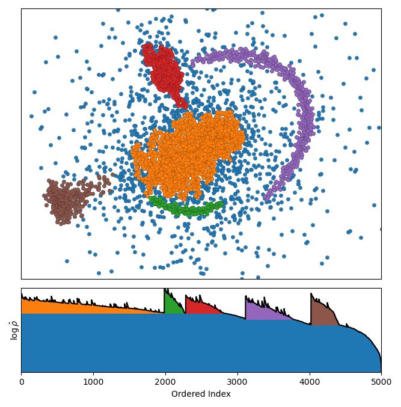

# How AstroLink Works

AstroLink is an astrophysical clustering algorithm that extracts hierarchical structure from point-based data. It was designed as an improvement to its predecessors, [CluSTAR-ND](https://doi.org/10.1093/mnras/stac1701) and [Halo-OPTICS](https://doi.org/10.1093/mnras/staa3879), and by comparison boasts increased clustering power in shorter run-times. The goal of this page is to provide an intuitive overview of how the AstroLink algorithm works &mdash; a more pegagogical description of how it works can be found in the AstroLink [science paper](https://doi.org/10.1093/mnras/stae1029).

AstroLink shares algorithmic ties to OPTICS and HDBSCAN, which can be thought of hierarchical extensions of DBSCAN, which itself can be thought of as a _more-robust-to-noise_ version of the Friends-Of-Friends (FOF) algorithm (which is commonly used to identify galaxies/haloes from cosmological simulations and is the basis for many other astrophysical clustering algorithms). However instead of being referred to the concepts used within these algorithms, it's likely easier to understand the functionality of AstroLink by way of a visual analogy (before then interpreting the computational details within AstroLink).

## A visual analogy

Imagine that we wanted to find the clusters from this 2-dimensional toy data set.

  

Although not the most complicated data set to extract clusters from, this data set represents a broad class of complicated clustering scenarios where the clusters are potentially hierarchical, arbitrarily shaped, have differing densities, may be unknown in quantity, and be defined by n-points in d-dimensions (for arbitrary n and d). And so essentially, we want to be able to identify clusters without turning a blind eye to any of these possibilities.

One way to achieve this is by considering the point-based data to be a random sample of some underlying probability distribution. If the probability density function is multi-modal, then some separable density-based structure exists and the modes (and the surrounding probability mass) are each representative of a cluster. Furthermore, if two modes are close to each we could consider these as being part of a parent mode, giving rise to a hierarchy of clusters.

.. note:: Alternatively, if we knew the functional form of the probability distribution of **each** cluster, we would be able to assign labels to the points in the data set more accurately. However, in general we don't know these distributions and attempting to find them would require us to make some limiting assumptions about what kinds of clusters exist within the data.

To be more specific, if we knew the underyling probability distribution of our data perfectly, we could simply decend the probability density function from high to low and mark the areas (volumes in higher dimensions) of probability mass that are enclosed by contour lines (surfaces) whenever a saddle point in the probability density function is reached and would merge two contour lines (surfaces). Given our toy data set, such a process would look something like that in the animation shown below.

  

The clusters found this way belong to a binary tree (since two clusters are created at every merge) which carries a lot of structural information, however this can become difficult to interpret for more complex data sets and as the hierarchy becomes deeper. Nevertheless, this tree could then be pruned so as to only retain the _relevant_ clusters... after which you might arrive at something that looks like the hierarchy shown below.

  

With this information, you could then assign point-wise labels based on whether the point resides inside the area (volume) of a cluster or not.

  

## So why isn't this what AstroLink does?

While the above process for identifying clusters from point-based data seems reasonable, it should only be used to get an intuition for how AstroLink works. In reality, there are some drawbacks of this analogous process that AstroLink does not have. Namely;

* **It is a very computationally expensive process.**
    - The probability density function shown in the above figures has been computed using a Gaussian kernel density estimator which scales quadratically with the number of points in the input data. It is also linearly dependent on the dimensionality of the input data. Computing fine-grained contour lines (surfaces) is also very expensive. As such, this approach would be difficult to apply to large data sets.
* **It does not perform well with a broad range of densities within the data.**
    - The clusters found are only as accurate as the density estimation, which in this case has a fixed bandwidth (smoothing scale). Essentially this means that the density estimation is most accurate for structures whose true spatial-density fluctuations vary on scales similar to (or larger than) this bandwidth. The effects can already be seen in the above examples as the dark blue and cyan clusters encompass a larger region than we would expect them to in order to get a good match on the finer structure within them.
* **It does not consider noise within the data.**
    - Although not shown in the animation above due to course grain determination of the probability density function, all data that is drawn from a continuous probability distribution will exhibit some spatial randomness. This leads to stochastic clumping which gives rise to spurious clusters. This method does not differentiate between statistically distinct or indistinct groups of points.
* **Checking whether a point is inside an area or volume is non-trivial.**
    - In theory, whether a point belongs inside a volume or not can be checked by casting a line from that point out to infinity in any direction. If the line crosses the boundary of the volume an odd number of times, then the point is inside the volume, otherwise it is not. However, computing this for every point-cluster combination becomes difficult when dealing with high dimensional volumes whose surfaces are approximated by polygons.

## The AstroLink algorithm explained step by step
Broadly speaking, the AstroLink algorithm uses five steps to extract clusters, and with the above analogous process in mind, we can now go through each of them in detail.

### Optionally transform the input data
The first step is to (optionally) transform the input data. Specifically, if the parameter `adaptive` is set to 1 (default) then the data is rescaled so that each of the dimensions will now have unit variance.

This removes the effect of having different units within the input data and allows AstroLink to be generally applicable to any point-based data set. However, if the relative scale of the features is meaningful (e.g. if the data was of Cartesian spatial coordinates only), then `adaptive` should be set to 0 to skip this step.

If we take the 2-dimensional toy data set in the analogy to be one of these cases where the relative scale of the features is meaningful, then we can should not transform the data and instead set `adaptive` to 0.

### Estimate the local-density field
The second step is to estimate the local-density field at the position of each of the points within the data set. The density is estimated with a kernel function and each point's `k_den` nearest neighbours and a scaled logarithm of this density is also taken, giving us $\log\hat\rho$.

This rescaling renders all noisy density fluctuations on the same scale (i.e. $\sigma_{\log\hat\rho}$ is approximately constant for a fixed `k_den` and `d_features`). This fact is used later in the algorithm to help distinguish clusters from noise.

The density is proportional to the underlying probability density function and, since the logarithmic rescaling is increasing function, the order is maintained. Hence if we order the $\log\hat\rho$ values and assign them colours from blue (low density) to red (high density), we can see something akin to the underlying probability density function.

  

The spatial contrast from blue to red indicates that the $\log\hat\rho$ values provide relevant structural information about the data.

### Compute an ordered list and a binary-tree of groups
Since the order of the $\log\hat\rho$ values are a tracer for the order of the probability density function evaluated at the position of each point, we can use this order to descend the probability density function as in the analogy above. However, during the process we also need to know _how_ the points connect to each other so that we can group them together to form clusters. AstroLink achieves this by creating edges between pairs of neighbouring points, with the edge weights being set to the minimum of the densities of the two points. Then instead of processing the data point-by-point in order of descending density it is processed edge-by-edge in order of descending edge weight.

While the edges are being processed, the group that each point belongs to is also kept track of. When an edge is being processed; if neither of the connecting points belong to a group then a new group is created with those points; if only one of the connecting points belong a group then the other is added to it; and if both of the connecting points belong to different groups then the groups are merged into a new group. The latter possibility is the AstroLink algorithmic equivalent to finding a saddle point in the probability density function, and when it occurs the two merged groups will be marked for further consideration.

So that a comparison can be made to the animation above, this process looks like the following animation for the same toy data set. Here, points are added to the animation once they are processed.

  

In this process, AstroLink also produces the 'ordered-density plot', shown here in the lower panel and coloured with all the marked groups. As shown in the animation, it is a 2-dimensional representation of the clustering structure and essentially, it contains all the density-based structural information that can be gleaned from the data without using model-based assumptions.

### Identify clusters as being statistical outliers from noisy density fluctuations
Due to the adaptive density estimation, the aggregation process will produce many groups. Some of these may be clusters but, provided that `k_den` is not so large that the density estimate is globally smooth, most will simply be noise. Therefore if we compute an appropriate measure of 'clusteredness' for these groups we should be able to distinguish between clusters and noise.

For this purpose AstroLink calculates each group's 'prominence', which is the maximum of the $\log\hat\rho$ values in the group subtracted by the $\log\hat\rho$ value at the boundary of the group and a measure of the intra-group noise. AstroLink takes the prominence value for each of the smaller groups merged at every saddle point (as they are inherently more noise-like) and fits a model to the resulting distribution.

The model, intended to be descriptive of both noise-like and cluster-like groups, consists of a Beta distribution (truncated on the right at `c`) and a uniform distribution (from `c` to 1). The two are scaled appropriately so that the model pdf is continuous at `c`. The significance of `c` is that it marks the data-driven best-guess transition between the prominences of noise-like groups and the prominences of cluster-like groups. Hence it can be used to determine clusters.

By plotting a histogram of the prominences (for the smaller groups), the fitted model, and the value of `c`, we can see how this works in action.

  

These prominence values are also transformed into a sigma-value using the fitted Beta distribution, providing a data-driven value for the significance parameter, `S`. In this case `S` is computed to be $3.1$ and hence AstroLink will find (unless `S` is otherwise specified) clusters that are $\geq3.1\sigma$ overdensities when compared to the noisy density fluctuations within the data.

If we plot the data and the ordered-density plot and colour these newly found clusters, we get the following:

  

.. note:: AstroLink always includes an additional cluster equal to the entire data set. This allows AstroLink to be applied modularly to disjoint data sets.

### Optionally adjust the hierarchy for interpretability
For some applications this classification scheme might be satisfactory. For example, when applying AstroLink to positions or position-velocities of particles in simulated galaxies, this classification scheme yields the substructure of the galaxy. However, in AstroLink the clusters up until this point have only been drawn from the set of smaller groups created in every merge. In general we would also like AstroLink to classify some of the larger groups as well.

If `h_style` is set to 1 (default), then AstroLink will incorporate some of these larger groups into the final hierarchy. Since these larger groups only exist due to their smaller counterparts (or rather neither would exist without the other), AstroLink will only take those larger groups whose smaller group counterparts have been labelled as clusters in the previous step. A check is made to ensure that these larger groups are also outliers (i.e. are their prominences greater than `c`). And lastly with the larger groups that still remain, AstroLink takes only the smallest out of those that share the same starting position in the ordered-density plot. This final filter ensures that AstroLink does not generate many cascading clusters that only differ by a small number of points.

If we have AstroLink take these steps and again plot the data and ordered-density plot with the resultant clusters, we see that one more cluster has been added.

  

The interpretation of this extra cluster is that it is the largest statistically non-separable overdensity in the data.

The data for this toy example is generated from analytic profiles. The green, red, brown, and purple clusters are generated from 3D Gaussian profiles in spherical coordinates that have been projected into the plane. The orange cluster is a combination of three 2D Gaussian profiles, however these are (deliberately) not separated enough to be considered distinct overdensities. The blue cluster (minus the others) is then closest to the background which is a larger-spread 2D Gaussian. Given this, AstroLink has found the clusters that I would have expected it to find without requiring any user input.
